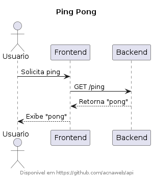
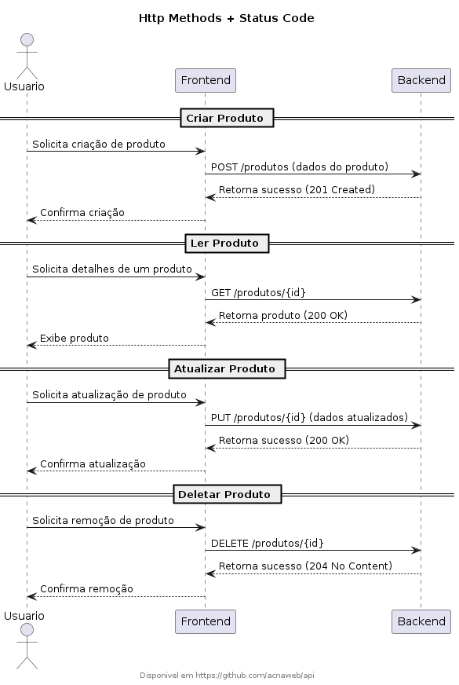
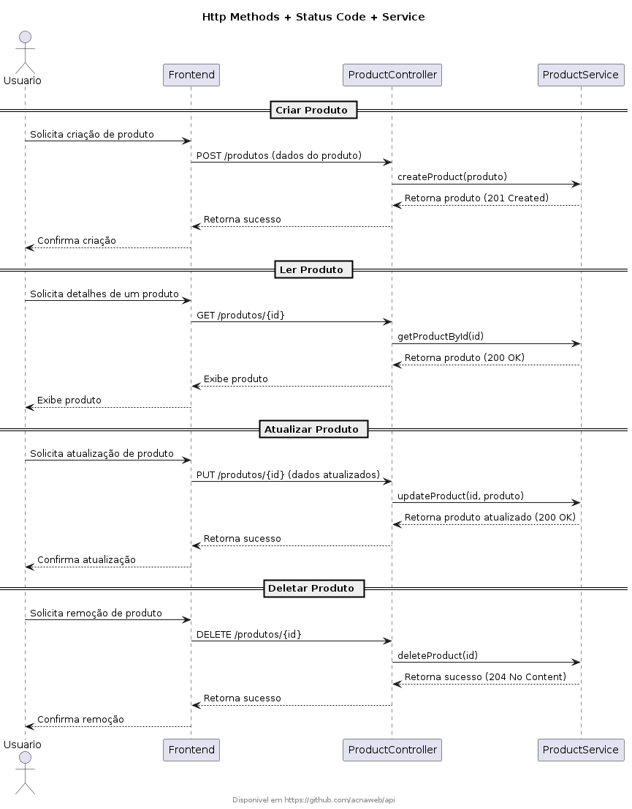
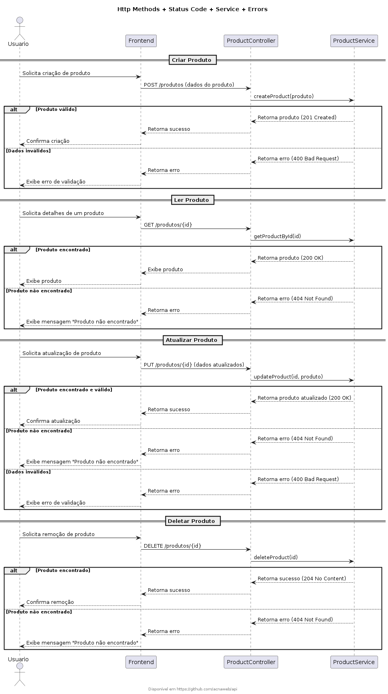

# API

Este guia apresenta uma sequência lógica para aprendizado de Microserviços, desde conceitos fundamentais até práticas avançadas, com exemplos para cada tópico

## Diagramas

Explicação:

- POST para criar um novo produto.
- GET para recuperar os detalhes de um produto.
- PUT para atualizar um produto existente.
- DELETE para remover um produto.

Explicação:
- Erros no POST (criação)
    - Se os dados forem inválidos, retorna 400 Bad Request.
- Erros no GET (leitura)
    - Se o produto não existir, retorna 404 Not Found.
- Erros no PUT (atualização)
    - Se o produto não existir, retorna 404 Not Found.
    - Se os dados forem inválidos, retorna 400 Bad Request.
- Erros no DELETE (remoção)
- Se o produto não existir, retorna 404 Not Found.

## Tópicos
---

### DTOs (Data Transfer Objects)
**Conceito:** Objetos para transferir dados entre camadas sem expor entidades do banco.  
**Exemplo:** Criar um `UserDTO` para retornar apenas nome e email, sem expor senha.

---

### Documentation
**Conceito:** Manter APIs bem documentadas para facilitar integração.  
**Exemplo:** Usar **Swagger/OpenAPI** para descrever endpoints e permitir testes interativos.

---

### Design Patterns
**Conceito:** Padrões arquiteturais comuns em microserviços, como Singleton, Factory, CQRS e Circuit Breaker.  
**Exemplo:** Aplicar o padrão **Circuit Breaker** para evitar falhas em cascata quando um serviço está indisponível.

---

### Tests
**Conceito:** Garantir qualidade do código com testes automatizados.  
**Exemplo:** Criar testes unitários com **JUnit** e testes de integração com **Postman/Newman**.

---

### Conteinerization
**Conceito:** Empacotar microserviços em containers para portabilidade.  
**Exemplo:** Criar um `Dockerfile` e rodar um microserviço em um container Docker.

---

### Pagination and Sorting
**Conceito:** Melhorar performance ao retornar grandes conjuntos de dados.  
**Exemplo:** Implementar paginação no Spring Boot com `Pageable` e parâmetros como `size` e `sort`.

---

### Security
**Conceito:** Proteção dos microserviços com autenticação e autorização.  
**Exemplo:** Implementar OAuth2 e JWT para autenticação segura.

---

### Migrations
**Conceito:** Controle de versão do banco de dados para manter consistência.  
**Exemplo:** Criar e aplicar migrations no **Flyway** ou **Liquibase** para versionar mudanças no banco.

---

### API Gateway
**Conceito:** Controlador centralizado para gerenciar requisições em múltiplos microserviços.  
**Exemplo:** Usar **Kong** ou **Apigee** para roteamento, autenticação e monitoramento de chamadas.

---

### Caching
**Conceito:** Melhorar performance armazenando dados frequentemente acessados.  
**Exemplo:** Usar **Redis** para armazenar respostas de API e reduzir carga no banco de dados.

---

### Versioning
**Conceito:** Controlar versões de APIs sem impactar clientes antigos.  
**Exemplo:** Criar uma API `v1/users` e `v2/users` para oferecer novas funcionalidades sem quebrar compatibilidade.

---

### Deploy
**Conceito:** Implantação escalável e automatizada de microserviços.  
**Exemplo:** Fazer deploy no **Cloud Run** ou **Kubernetes**, garantindo escalabilidade sob demanda.
